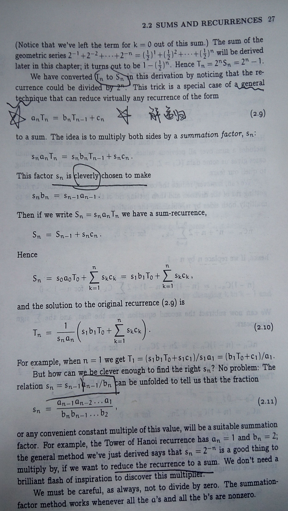

# Chapter 2 sum
## 2.2 sums and recurrences
递归和求和的关系在与：许多递归可以化简为sum

a general technique that can reduce virtual any recurrence of the form

让两边都乘以S_n:

构造一个s_n，使得

如下图所示：

**example**
quicksort comparison steps is  
  
0" >
how to calc ?
A:p29

> harmonic number: the kth harmonic produced by a violin string is the fundamental tone produced by a string that is 1/k times as long

## 2.3 manipulation of sums
commutative law:

like permutation:for every n should be exactly one k permute

> calculus 微积分

## 2.4 multiple sums
general distributive law:

