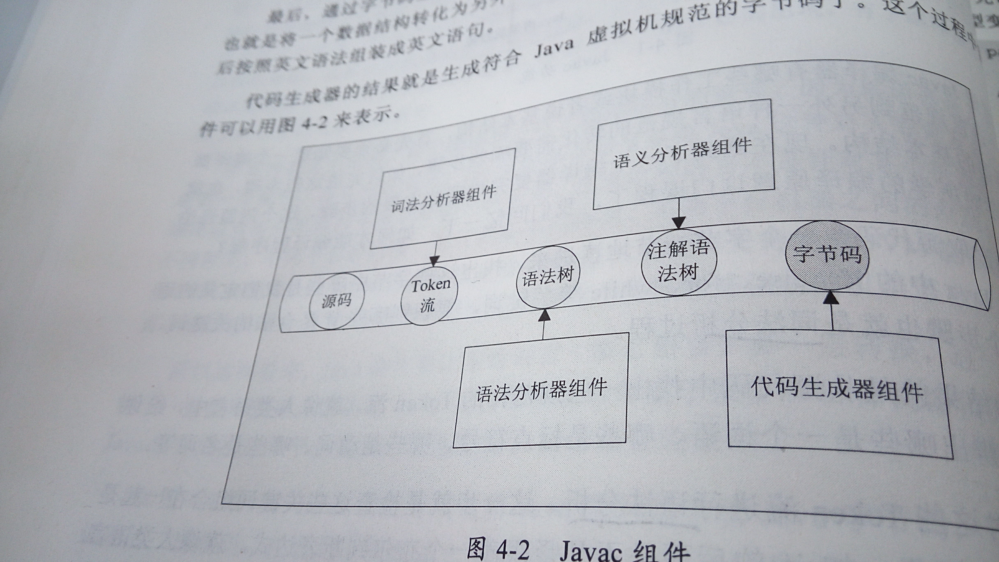

Ch4javac编译原理

2015年11月15日
16:12

# java语言规范：语法和词法
java虚拟机规范
javac是将java**语言规范**转化为javav虚拟机**语言规范**

编译器：将一种语言规范转化为另一种语言规范

Java --javac--》 java字节码 --jvm--》机器语言

# 编译器
	- 词法分析
	- 语法分析，抽象语法树 ，
	- 语义分析，将复杂的语法转化为简单的语法，形成注解后的抽象语法树
	- 字节码生成器，将一种数据结构转化为另一种数据结构
